# JWT Token Create
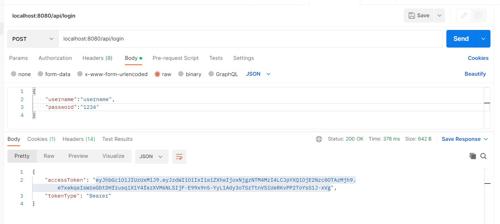
## Result
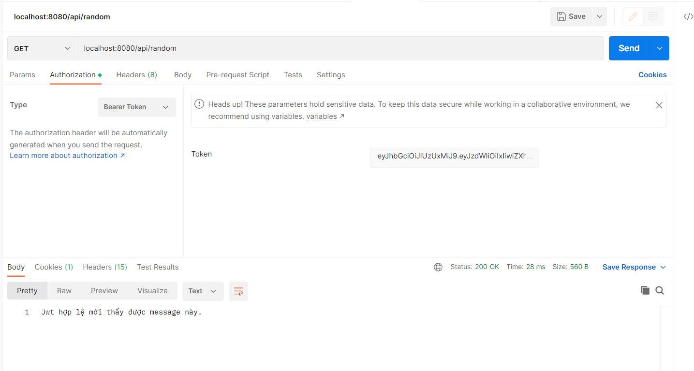

# Spring boot Test 
## Code CRUD for Category 
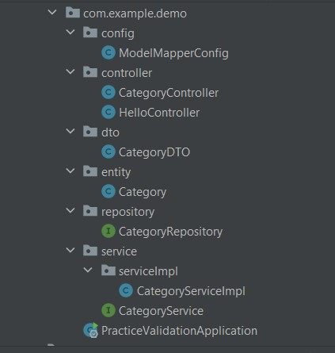
## Testing for all layer of Category
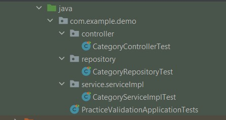
### Kết quả
#### Entity Test 
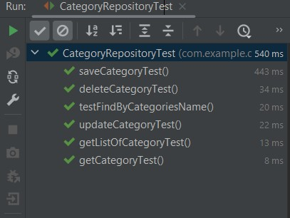
#### Service Test
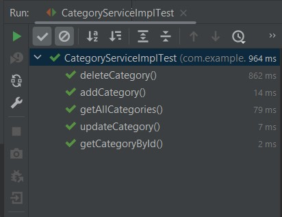
#### Controller Test 
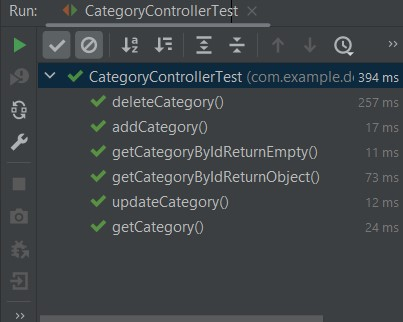
# Actutor, Dev Tool
## Actutor 
### Config Actutor
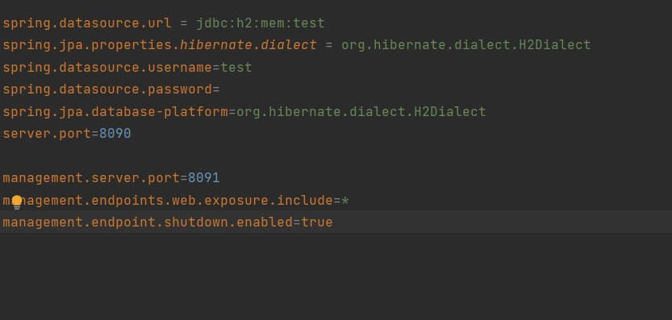
### Actutor Result 
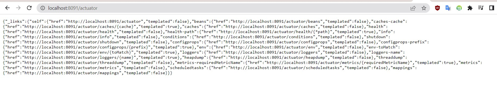
- Endpoint
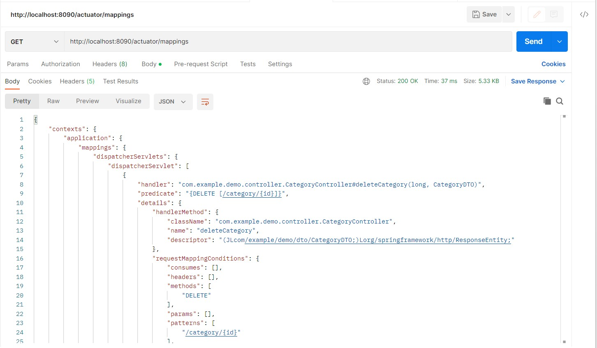
- Health 
- 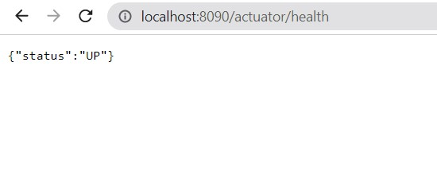
- Shut Down by Actuator 
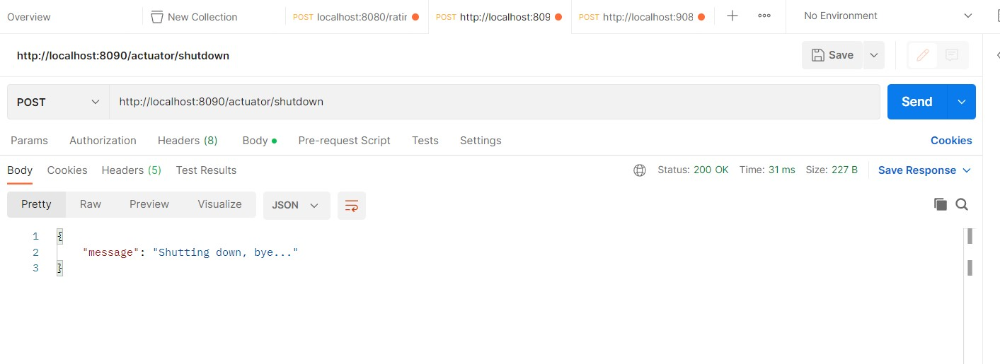
### Change port 8090 to 8091 
Before change 
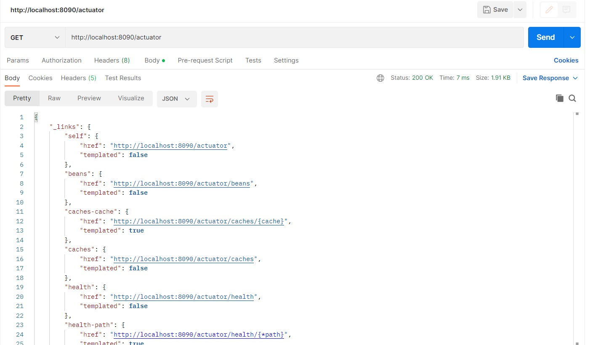
- Change Port on application.properties 
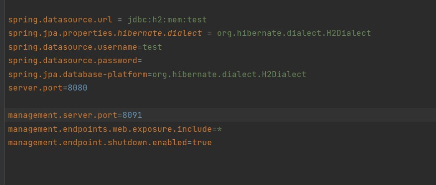
- Then build application and see result 
- 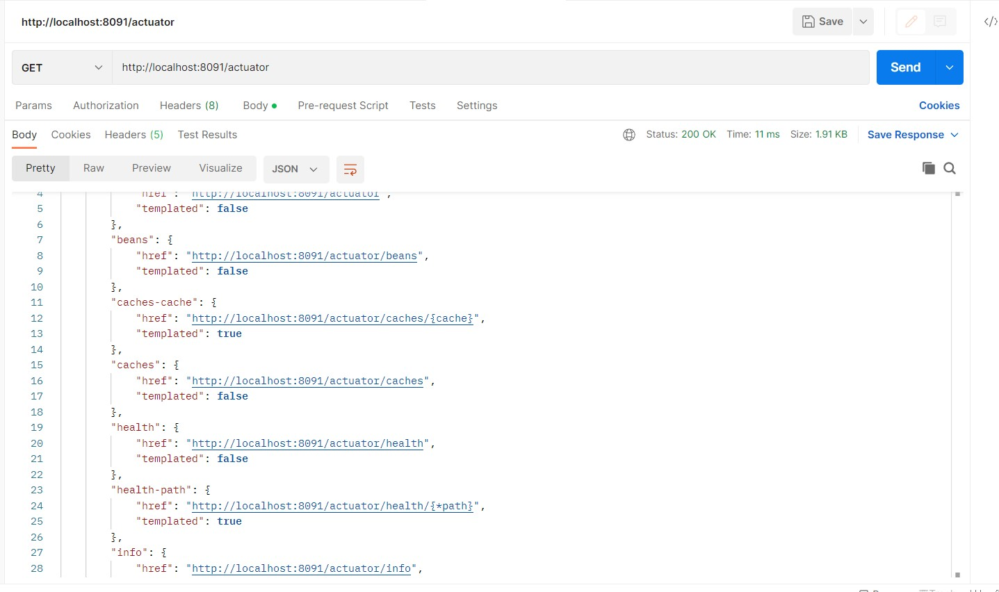
### Enpoint sau khi doi port 
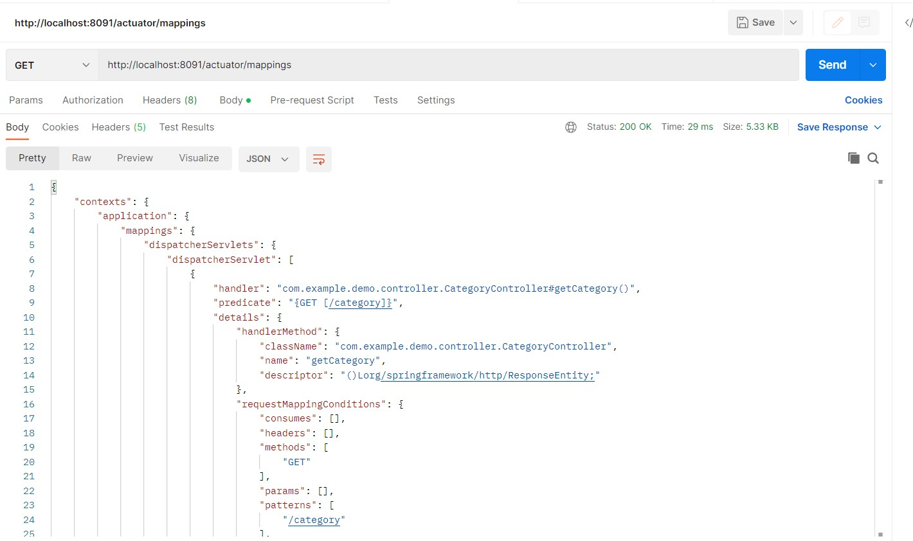