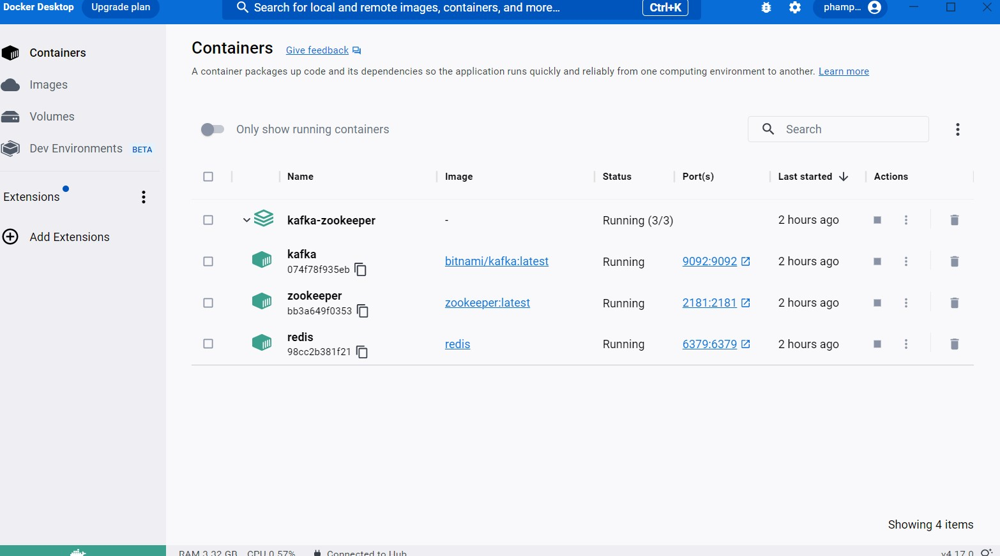
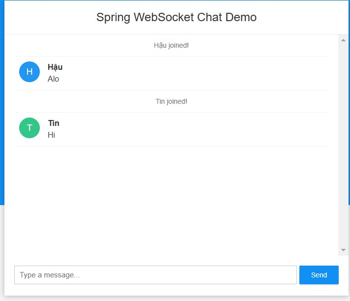
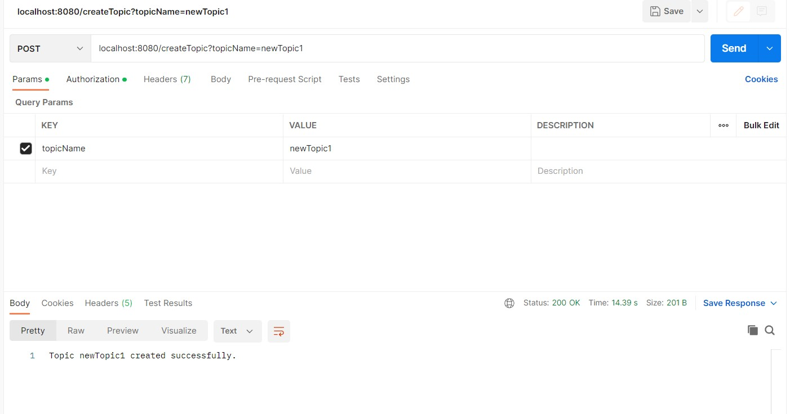
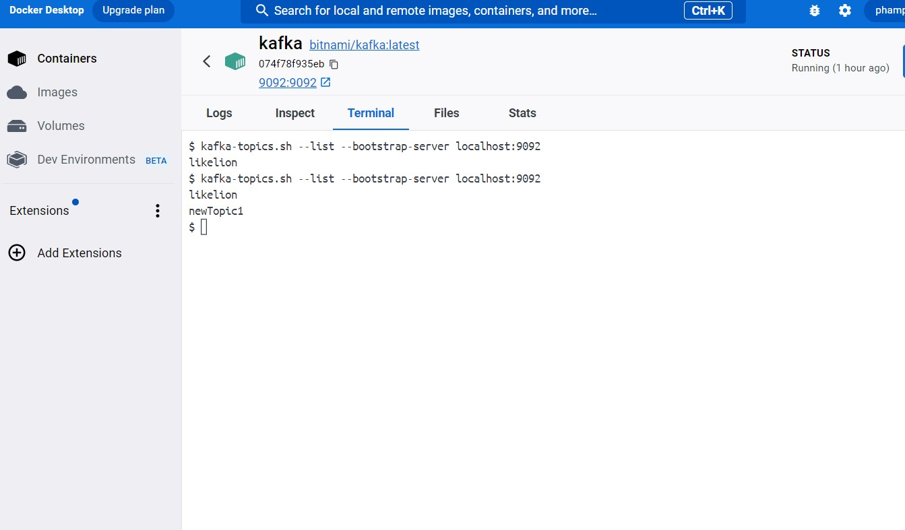
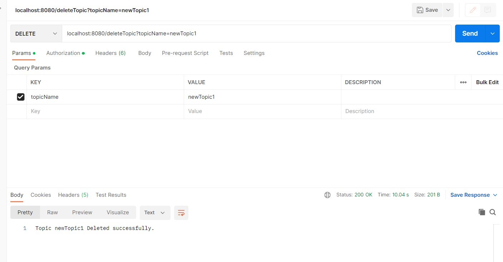
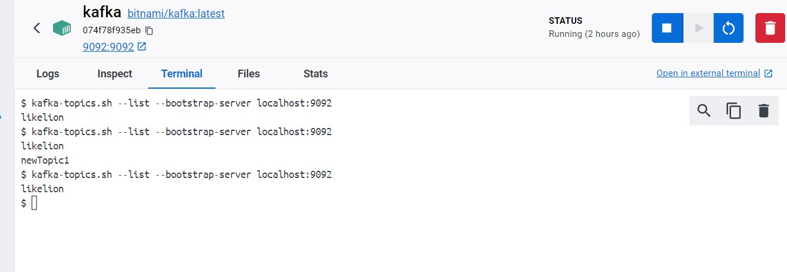
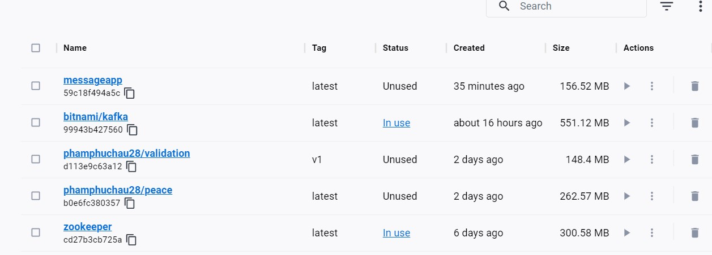
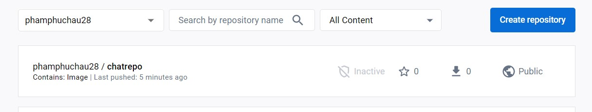

# Message Application
### Docker Kafka Redis Zookeeper
``` version: '3'

services:
zookeeper:
image: zookeeper
container_name: zookeeper
ports:
- "2181:2181"
environment:
ALLOW_PLAINTEXT_LISTENER: yes
kafka:
image: bitnami/kafka
container_name: kafka
ports:
- "9092:9092"
environment:
KAFKA_ADVERTISED_HOST_NAME: localhost
KAFKA_ZOOKEEPER_CONNECT: zookeeper:2181
ALLOW_PLAINTEXT_LISTENER: yes
redis:
image: redis
container_name: redis
ports:
- "6379:6379 
```
### Chạy Docker compose
``` docker compose up   ```

## Kafka Consumer Config
```
@Configuration
public class KafkaConsumerConfig {
    @Value("${spring.kafka.bootstrap-servers}")
    private String bootstrapServers;
    public Map<String, Object> consumerConfig(){
        Map<String, Object> props = new HashMap<>();
        props.put(ConsumerConfig.BOOTSTRAP_SERVERS_CONFIG, bootstrapServers);
        props.put(ConsumerConfig.KEY_DESERIALIZER_CLASS_CONFIG, StringSerializer.class);
        props.put(ConsumerConfig.VALUE_DESERIALIZER_CLASS_CONFIG, StringSerializer.class);
        return props;
    }
    @Bean
    public ConsumerFactory<String, String> consumerFactory() {
        return new DefaultKafkaConsumerFactory<>(consumerConfig());
    }
    @Bean
    public KafkaListenerContainerFactory<ConcurrentMessageListenerContainer<String, String >> factory (
            ConsumerFactory<String, String> consumerFactory) {
        ConcurrentKafkaListenerContainerFactory<String, String> factory = new ConcurrentKafkaListenerContainerFactory<>();
        factory.setConsumerFactory(consumerFactory);
        return factory;
    }
}
 ```
## Kafka Producer Config 
```
@Configuration
public class KafkaProducerConfig {
    @Value("${spring.kafka.bootstrap-servers}")
    private String bootstrapServers;
    public Map<String, Object> producerConfig(){
        Map<String, Object> props = new HashMap<>();
        props.put(ProducerConfig.BOOTSTRAP_SERVERS_CONFIG, bootstrapServers);
        props.put(ProducerConfig.KEY_SERIALIZER_CLASS_CONFIG, StringSerializer.class);
        props.put(ProducerConfig.VALUE_SERIALIZER_CLASS_CONFIG, StringSerializer.class);
        return props;
    }
    // ProducerFactory responsible for creating instances
    @Bean
    public ProducerFactory<String, String> producerFactory() {
        return new DefaultKafkaProducerFactory<>(producerConfig());
    }
    // KafkaTemplate allows us to create kafka producers we need a way for us to send messages
    @Bean
    public KafkaTemplate<String, String> kafkaTemplate(ProducerFactory<String, String> producerFactory){
        return new KafkaTemplate<>(producerFactory);
    }
}

```
### Redis Config 
```
@Configuration
@EnableCaching
public class RedisConfig extends CachingConfigurerSupport {
    @Value("${redis.host}")
    private String redisHost;
    @Value("${redis.port}")
    private int redisPort;
    @Bean
    public Gson gson() {
        return new GsonBuilder()
                .setDateFormat("yyyy-MM-dd'T'HH:mm:ss.SSSZ")
                .create();
    }

    @Bean
    public LettuceConnectionFactory redisConnectionFactory() {
        RedisStandaloneConfiguration config = new RedisStandaloneConfiguration(redisHost, redisPort);
        return new LettuceConnectionFactory(config);
    }
    @Bean
    public KeyGenerator keyGenerator() {
        return new SimpleKeyGenerator();
    }
    @Bean
    public RedisSerializer<Object> jsonRedisSerializer() {
        return new GenericJackson2JsonRedisSerializer();
    }
    @Bean
    public RedisCacheConfiguration cacheConfiguration() {
        return RedisCacheConfiguration.defaultCacheConfig()
                .entryTtl(Duration.ofMinutes(5))
                .serializeKeysWith(RedisSerializationContext.SerializationPair.fromSerializer(new StringRedisSerializer()))
                .serializeValuesWith(RedisSerializationContext.SerializationPair.fromSerializer(new GsonRedisSerializer(gson())))
                .disableCachingNullValues();
    }

    @Bean
    public CacheManager cacheManager(RedisConnectionFactory redisConnectionFactory) {
        Map<String, RedisCacheConfiguration> cacheConfigurations = new HashMap<>();
//        cacheConfigurations.put("myCache", cacheConfiguration().entryTtl(Duration.ofMinutes(10)));
//        cacheConfigurations.put("anotherCache", cacheConfiguration().entryTtl(Duration.ofHours(1)));
        RedisCacheManager cacheManager = RedisCacheManager.builder(redisConnectionFactory)
                .cacheDefaults(cacheConfiguration())
                .withInitialCacheConfigurations(cacheConfigurations)
                .build();
        return cacheManager;
    }
}

```
### WebSockerConfig
```
@Configuration
@EnableWebSocketMessageBroker
public class WebSocketConfig implements WebSocketMessageBrokerConfigurer {
    @Autowired
    private RedisConnectionFactory redisConnectionFactory;

    @Override
    public void configureMessageBroker(MessageBrokerRegistry registry) {
        registry.enableSimpleBroker("/topic", "/queue")
                .setHeartbeatValue(new long[]{10000, 10000})
                .setTaskScheduler(taskScheduler())
        ;
        registry.setApplicationDestinationPrefixes("/app");
    }

    @Bean
    public TaskScheduler taskScheduler() {
        return new ConcurrentTaskScheduler();
    }

    @Bean
    public RedisTemplate<String, Object> redisTemplate() {
        RedisTemplate<String, Object> template = new RedisTemplate<>();
        template.setConnectionFactory(redisConnectionFactory);
        template.setKeySerializer(new StringRedisSerializer());
        template.setValueSerializer(new Jackson2JsonRedisSerializer<>(ChatMessage.class));
        return template;
    }

    @Override
    public void registerStompEndpoints(StompEndpointRegistry registry) {
        registry.addEndpoint("/ws").withSockJS();
    }


}

```
### Chat Controller 
```
@Controller
@RequestMapping("/")
public class ChatController {
    @Autowired
    private RedisTemplate redisTemplate;

    @Autowired
    private SimpMessagingTemplate messagingTemplate;

    @Autowired
    private CacheManager cacheManager;

    @MessageMapping("/chat.sendMessage/{roomId}")
    @SendTo("/topic/{roomId}")
    public ChatMessage sendMessage(@Payload ChatMessage chatMessage
            , @DestinationVariable String roomId
    ) {
        redisTemplate.opsForList().rightPushAll(roomId, chatMessage);
        return chatMessage;
    }

    @MessageMapping("/chat.addUser/{roomId}")
    @SendToUser("/queue/reply")
    public List<ChatMessage> addUser(
            @Payload ChatMessage chatMessage
            , @DestinationVariable String roomId
    ) {
        messagingTemplate.convertAndSend("/topic/" + roomId, chatMessage);
        List<ChatMessage> chatHistory = redisTemplate.opsForList().range(roomId, 0, -1);
        return chatHistory;
    }

    @GetMapping("/")
    public String main() {
        return "chat";
    }

    @GetMapping("/remove/{roomId}")
    @ResponseBody
    public void remove(@PathVariable(name = "roomId") String roomId) {
        redisTemplate.opsForList().trim(roomId, 1, 0); // This will remove all elements of the list.
    }

    @GetMapping("/get/{roomId}")
    @ResponseBody
    public List<ChatMessage> get(@PathVariable(name = "roomId") String roomId) {
        return redisTemplate.opsForList().range(roomId, 0, -1);
    }

    @GetMapping("/testCache/{roomId}")
    @ResponseBody
    @Cacheable(value = "testCache", key = "#roomId")
    public String testCache(@PathVariable(name = "roomId") String roomId) {
        Random rand = new Random();
        int n = rand.nextInt(50);
        System.out.println(n);
        return roomId + n; //5
    }

    @GetMapping("/testCache2/{roomId}")
    @ResponseBody
    @CachePut(value = "testCache", key = "#roomId")
    public String testCache2(@PathVariable(name = "roomId") String roomId) {
        Random rand = new Random();
        int n = rand.nextInt(50);
        System.out.println(n);
        return roomId + n;
    }

    @GetMapping("/getCache/{roomId}")
    @ResponseBody
    public String getCache(@PathVariable(name = "roomId") String roomId) {
        Cache cache = cacheManager.getCache("testCache");
        Cache.ValueWrapper valueWrapper = cache.get(roomId);
        if (valueWrapper != null) {
            return valueWrapper.get().toString();
        }
        return null;
    }
}

```
### Message Chat 


### Dynamic Topic
#### Kafka Config Topic 
```
@Configuration
public class DynamicTopicKafka {
    @Value("${spring.kafka.bootstrap-servers}")
    private String bootstrapServers;
    @Bean
    public Map<String, Object> configAdminClient(){
        Map<String, Object> props = new HashMap<>();
        props.put(AdminClientConfig.BOOTSTRAP_SERVERS_CONFIG, bootstrapServers);
        return props;
    }

    public void createDynamicTopic(String topicName)
    {
        AdminClient adminClient=AdminClient.create(configAdminClient());
        NewTopic topic = new NewTopic(topicName, Collections.emptyMap());
        try {
            adminClient.createTopics(Collections.singletonList(topic)).all().get();
        } catch (ExecutionException | InterruptedException e) {
            if (e.getCause() instanceof TopicExistsException) {
                System.out.println("Topic already exists");
            } else {
                e.printStackTrace();
            }
        }

    }
    public void deleteDynamicTopic(String topicExist)
    {
        try {
            AdminClient adminClient = AdminClient.create(configAdminClient());
            adminClient.deleteTopics(Collections.singletonList(topicExist)).all().get();
        }
        catch (ExecutionException | InterruptedException e){
            if (e.getCause() instanceof TopicExistsException) {
                System.out.println("Topic already exists");
            } else {
                e.printStackTrace();
            }
        }
    }
}

```
#### Topic Controller 
```
@RestController

public class TopicController {
    @Autowired
    private DynamicTopicKafka dynamicTopicKafka;
    @PostMapping("createTopic")
    public ResponseEntity<String> createTopic(@RequestParam String topicName){
        dynamicTopicKafka.createDynamicTopic(topicName);
        return ResponseEntity.ok("Topic " + topicName + " created successfully.");
    }
    @DeleteMapping("deleteTopic")
    public ResponseEntity<String> deleteTopic(@RequestParam String topicName){
        dynamicTopicKafka.deleteDynamicTopic(topicName);
        return ResponseEntity.ok("Topic " + topicName + " Deleted successfully.");
    }
}
```
### Test
#### Create 
- Postman

- Kafka

#### Delete 
- Postman

- Kafka

### Docker 
- Dockerfile
```
FROM maslick/minimalka:jdk11
VOLUME /tmp
ARG JAR_FILE=target/*.jar
COPY ${JAR_FILE} app.jar
ENTRYPOINT ["java", "-jar", "/app.jar"]
```
- Docker create image 
```
docker build -t messageapp .      
```
- Result
- 
-- Docker run image become container 
```
docker run  --name MessaggeApp -p18080:18080 messageapp

```
- Result 


### Push to Docker hub 
- Re-tagging an existing local image
```
docker tag messageapp phamphuchau28/chatrepo:latest 
```
- Now you can push this repository to the registry designated by its name or tag.
```
docker push phamphuchau28/chatrepo:latest  
```
- Result 
