# Spring Boot Properties, Logging, AOP,Validation
## Cấu hình ứng dụng
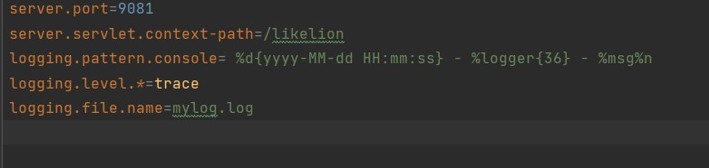
## Validation
- Code 
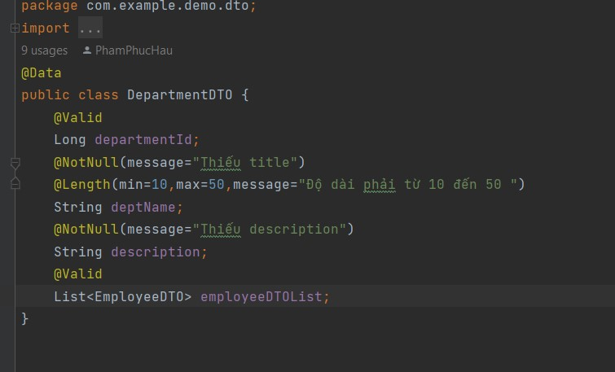
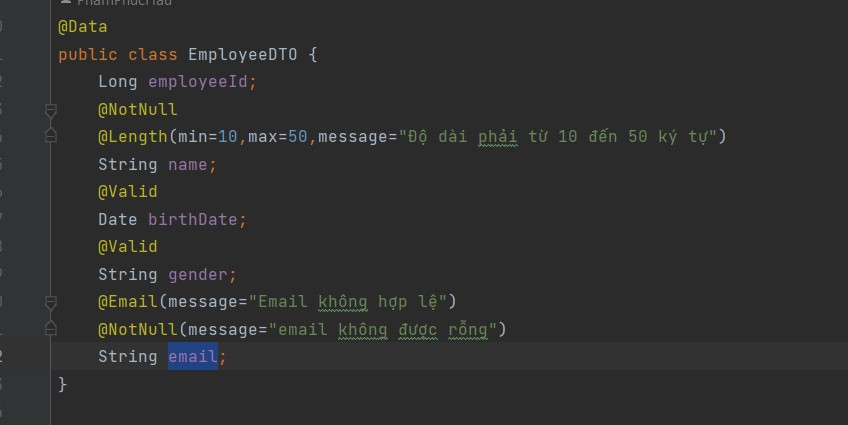
- Kết quả
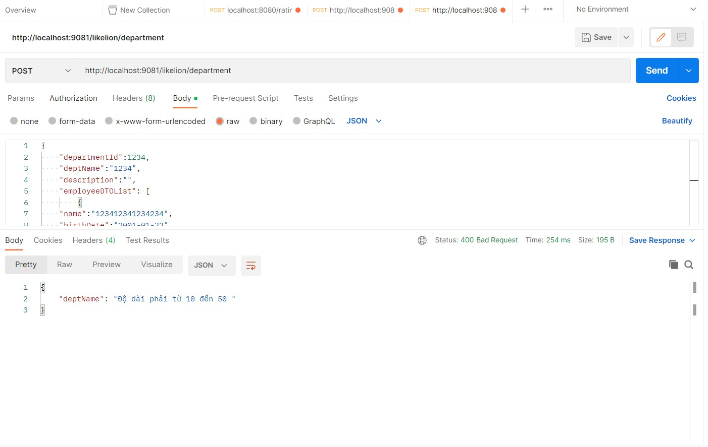
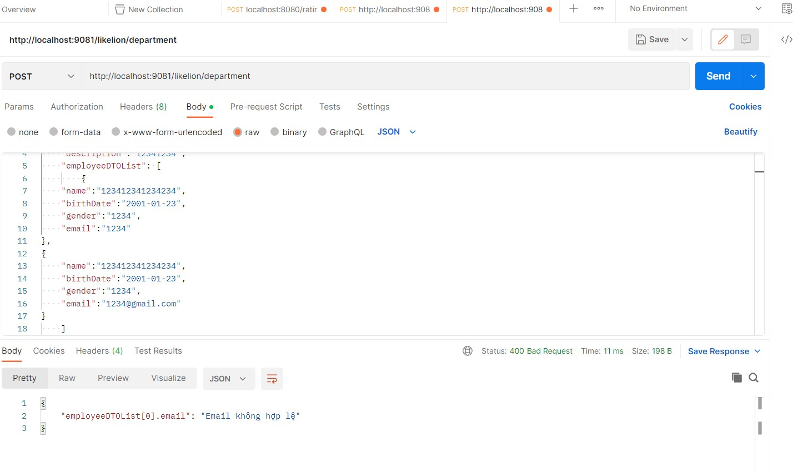
## AOP Logging
- Success
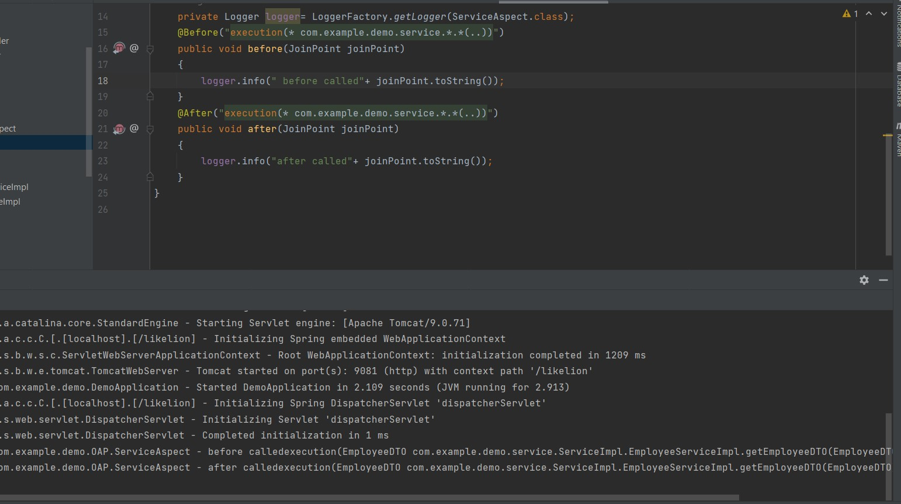
-  Error
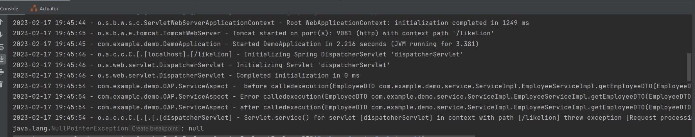
# Exception, Filter, Interceptor
## Exception
- Code
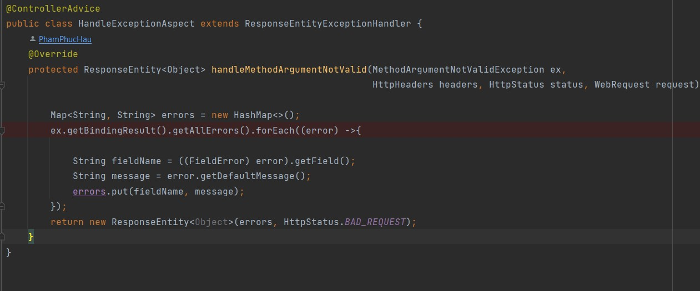
## Interceptor
- Kết quả
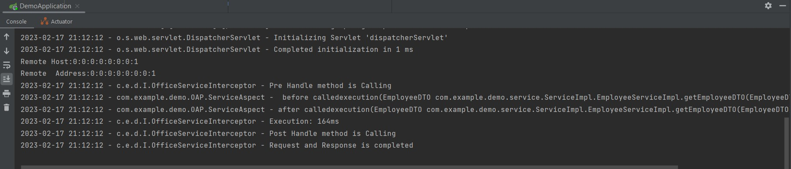
## Filter
- Code
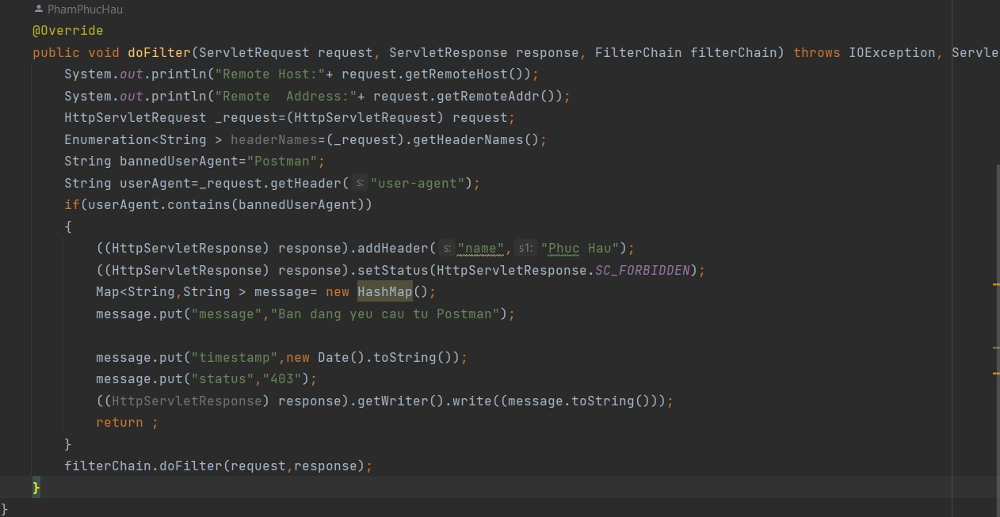
- Kết quả
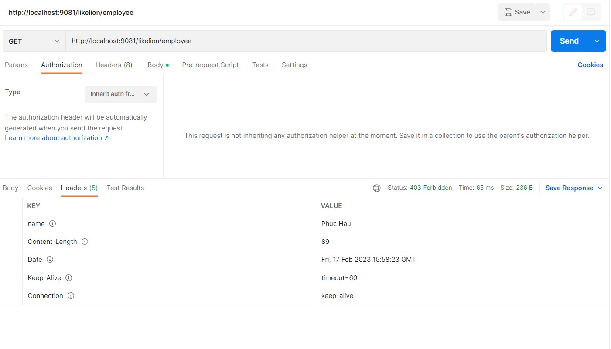
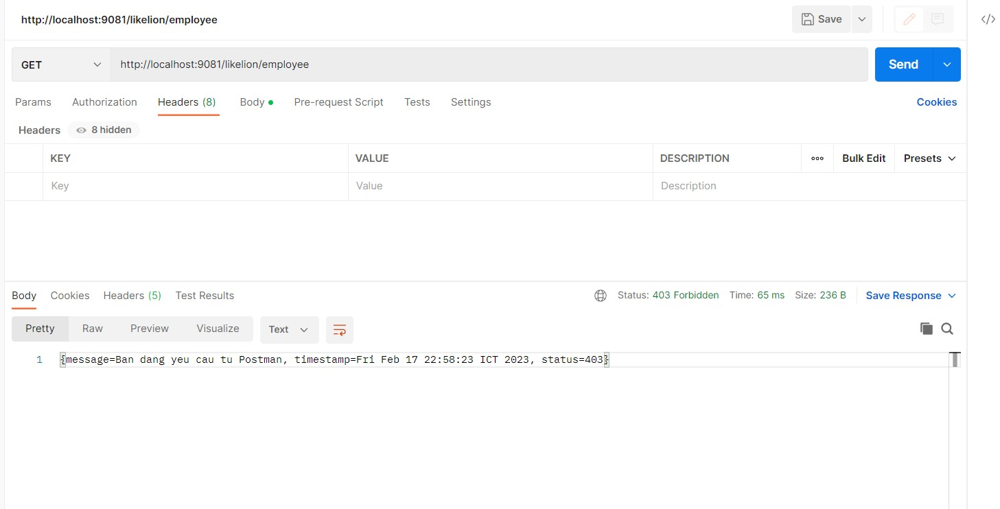
